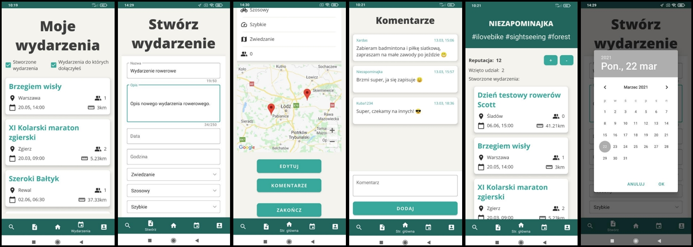

<h1 align="center">
 <strong>Let's Ride</strong>
   
</h1>

## Table of contents
* [Introduction](#introduction)
* [Features](#features)
* [Screenshots](#screenshots)
* [Technologies](#technologies)

## Introduction
This is application, which i made for my Engineer Thesis purpose. The application allows user to create a bicycle event, along with specifying data such as: name of the event, description, starting place, planned destination (with visualization on the map), event type, recommended bike type and pace. Other users can take part in the created event and communicate with each other by means of comments. The application has a system for searching and filtering trips, based on, among others distance to the starting point, distance, difficulty level, as well as the user reputation system. Each of them has their own profile that can be personalized.
The application was developed in the Android Studio environment, using the Java language. The Firebase platform was used to store and process data about events and users.
<h1><b>Due to law regulations, which gives my University right to my source code within certain amount of time, i cannot share source of this application till 2022 </h1>  Source code is commited to other, private repository, which will be public since 2022 </b>

## Features
* Create an Bicycle Event, with specified features like bicycle type, speed, description
* Use map provided by Google Maps API, to specify event road
* Take part in event, close the event, or modify it
* Write comments, to stay connected with other participants
* Rate users, view their profile page, events they created and taken part in
* Search events, using many filtering options, such as: Distance from current location to starting point, event distance, bicycle type, content of event title, etc.
* Browse newest and most popular events

## Screenshots

 

## Technologies
* Java
* Android Studio
* Firebase Cloud Firestore
* Firebase Authentication
* Glide library
* Material Design
* MVVM Pattern
* View Binding
* Google Maps API

Application tested on various Android Mobile devices, such as:
* Xiaomi Redmi 9T
* Xiaomi Redmi Note 7
* Motorola G8
* Pixel 4 (emulated)
